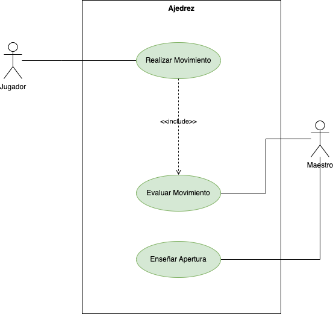

# Ajedrez:

  

Nuestro sistema proporciona la posibilidad de que un jugador haga un movimiento de las fichas, el jugador tiene un tiempo de juego,  y luego vuelve a juego nuevamente. El sistema proporciona que el maestro evalúa su jugadas y enseña nueva apertura.  

Realiza:
- Identifica los actores.
- Identifica los __CU__ de cada uno de los actores.
- Realiza el diagrama de CU.

      
PULSA PARA VER LA SOLUCIÓN 

   

  
   

|  Actor | Jugador |
|---|---|
| Descripción  | Jugador que esta aprendiendiendo a jugar.  |
| Características  |  |
| Relaciones | No tiene relaciones con otros actores  |
| Referencias | __C.U.1__ |   
|  Notas |   |
| Autor  | Joatham Pérez Expósito |
|Fecha | 12/01/2023 |

|  Atributo |||
|---|---|---|
| _Nombre_  | _Descripción_  | _Tipo_ |
| | |

|  Actor | Maestro |
|---|---|
| Descripción  | Maestro que evalua y enseña.  |
| Características  |  |
| Relaciones | No tiene relaciones con otros actores  |
| Referencias | __C.U.2,C.U.3__ |   
|  Notas |   |
| Autor  | Joatham Pérez Expósito |
|Fecha | 12/01/2023 |

|  Atributo |||
|---|---|---|
| _Nombre_  | _Descripción_  | _Tipo_ |
| | |

|  Caso de Uso	CU | CU1 Realizar Moviemiento |
  |---|---|
  | Fuentes  | _Descripción del ejercicio_  |
  | Actor  |  _Jugador_ |
  | Descripción | _Se realiza un movimiento válido del ajedrez para una ficha dada_  |
  | Flujo básico | _Se selecciona una ficha y realiza un movimiento._ |
  | Pre-condiciones |  |  
  | Post-condiciones  | _Validar el movimiento_  |  
  |  Requerimientos |   |
  |  Notas |   |
  | Autor  | _Joatham Pérez Expósito_ |
  |Fecha | _12/01/2023_ |

|  Caso de Uso CU | CU2 Evaluar Apertura  |
  |---|---|
  | Fuentes  | _Descripción del ejercicio_  |
  | Actor  |  _Maestro_ |
  | Descripción | _Se realiza la validación del movimiento del jugador_  |
  | Flujo básico | _Se realiza un movimiento > Se realiza la validación del movimiento ejecutado._ |
  | Pre-condiciones | Ejecución del __CU1__. |  
  | Post-condiciones  |   |  
  |  Requerimientos |   |
  |  Notas |   |
  | Autor  | _Joatham Pérez Expósito_ |
  |Fecha | _12/01/2023_ |

|  Caso de Uso CU | CU3  |
  |---|---|
  | Fuentes  | _Descripción del ejercicio_  |
  | Actor  |  _Maestro_ |
  | Descripción | _Se enseña una nueva apertura al jugador_  |
  | Flujo básico |  |
  | Pre-condiciones |  |  
  | Post-condiciones  |   |  
  |  Requerimientos |   |
  |  Notas |   |
  | Autor  | _Joatham Pérez Expósito_ |
  |Fecha | _12/01/2023_ |

