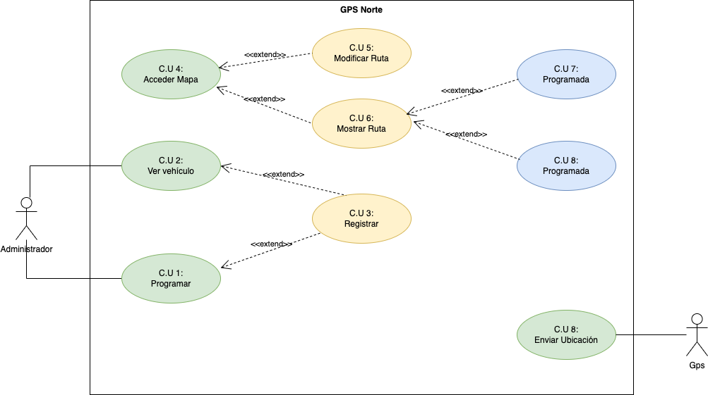

  

 

  Una empresa de transporte de mercancías quiere hacer una supervisión de todos los camiones de los que dispone. Para eso ha diseñado una nueva aplicación web llamada GPSPuerto.

  En esta aplicación un administrador registra unos GPS especiales con 4G y les asigna un nombre. Básicamente el nombre es la matrícula del camión o furgoneta.

  Para la aplicación un GPS y un vehículo es la misma cosa.

  El administrador programa unas rutas para cada transporte con una fecha/hora de salida, fecha/hora de llegada (prevista). Y de esa manera se puede conocer qué vehículos están operativos en un momento determinado.

  Estos GPS envían cada 5 minutos la localización exacta del dispositivo a la web mediante comunicación 4G.

  El administrador puede acceder a un mapa en el que aparecen en el mismo geolocalizados los distintos camiones y dependiendo de su ubicación puede modificar la ruta. Dentro del mismo mapa puede elegir mostrar solamente aquellos vehículos que tengan una ruta programada en ese momento. También puede pedir mostrar aquellos vehículos que no tienen ninguna ruta programada y de esa manera ver dónde se ubican por si hiciese falta realizar un porte. El administrador generalmente elige el vehículo más cerca del origen de la ruta.

Realiza:
- Identifica los actores.
- Identifica los __CU__ de cada uno de los actores.
- Realiza el diagrama de CU.

 

      
PULSA PARA VER LA SOLUCIÓN 

   
  Realice el diagrama de casos de uso del sistema GPSPuerto.

  

## Especificación de Casos de Uso:

  

## Índice
  - [Introducción](#introducción).
  - [Descripción](#descripción).
  - [Especificación de actores](#especificación-de-actores).
  - [Especificación de casos de uso](#especificación-de-casos-de-uso-1).

### Introducción

  El presente documento especifica el __diagrama de casos de uso__ de la aplicación __GPSNorte__ solicitada por la empresa de transporte del norte de Tenerife.

  Este documento trata a grandes rasgos, los casos de uso identificados, así como los actores que intervienen en ellos.

  

    
  

### Descripción

  Una empresa de transporte de mercancías quiere hacer una supervisión de todos los camiones de los que dispone. Para ello, se han especificado una serie de requisitos descritos en el presente documento.

### Especificación de Actores

  En el presente documento se realiza la especificación de los diferentes actores que intervienen en la solución propuesta.

#### GPS

  |  Actor | GPS |
  |---|---|
  | Descripción  | Sistema encargado del envío de la señal de gps cada 5 minutos  |
  | Características  | |
  | Relaciones |   |
  | Referencias | __Enviar ubicación__ |   
  |  Notas |   |
  | Autor  | _Joatham Pérez Expósito_ |
  |Fecha | _12/01/2023_ |

  |  Atributo |||
  |---|---|---|
  | _Nombre_  | _Descripción_  | _Tipo_ |
  | ubicación | Ubicación del vehículo | double[2] |

#### Administrador

  |  Actor | GPS |
  |---|---|
  | Descripción  | Gestor de GPSPuerto | |
  | Relaciones |   |
  | Referencias | __Elegir Vehículo, Programar Ruta, Registrar GPS, Visualizar Mapa (Vehículos Activos Vehículos Parados), Modificar Ruta , Mostrar Ruta (Programadas, No Programadas)__ |   
  |  Notas |   |
  | Autor  | _Joatham Pérez Expósito_ |
  |Fecha | _12/01/2023_ |

### Especificación de Casos de uso

>

