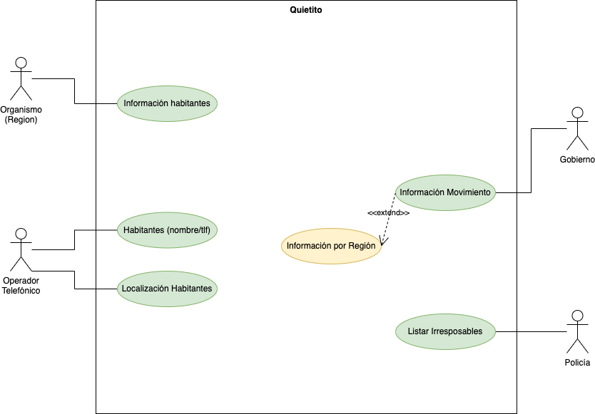

  

 

El gobierno de la republica independiente del Puerto dela Cruz, realizar una aplicación para mantener monitorizados a los habitantes frente a una posible pandemia mundial que los mantendría confinados en sus casas.

El gobierno ha creado un sistema que le va a llamar Quietito. Este sistema recibirá una serie de datos en formato JSON de un organismo oficial el cual clasifica a los habitantes entre __confinado__ y __libre moviemnto__ (transportistas, sanitarios, trabajadores de supermercados y tiendas de alimentos, etc). Además el programa almacena  por cada habitante su domicilio.

Asimismo, recibirá otro fichero en formato JSON con el nombre de los habitantes y su número de télefono.

Tras insertar estos datos, el gobierno recibirá de forma periódica la localización de los smartphones cada hora y así podrá determinar si una persona con etiqueta __confinada__ está a más de 250 metros de su casa _(límite establecido por el gobierno)_.

Tras la recepción de esos datos, el sistema ofrecerá al gobierno una estadística global del número de personas que se saltan el confinamiento por días. Además el sistema podrá crear la misma estadística pero clasificada por provincias.

De la misma manera, las policías podrán acceder y recibir un listado de los habitantes que se han saltado el confinamiento y el número de días que se lo han saltado para proceder a su identificación y su denuncia si lo creen pertinente.

Realiza:
- Identifica los actores.
- Identifica los __CU__ de cada uno de los actores.
- Realiza el diagrama de CU.

<!--  

      
PULSA PARA VER LA SOLUCIÓN 

   
  
   
-->

  

## Especificación de Casos de Uso:

  

## Índice
  - [Introducción](#introducción).
  - [Descripción](#descripción).
  - [Especificación de actores](#especificación-de-actores).
  - [Especificación de casos de uso](#especificación-de-casos-de-uso-1).

### Introducción

  El presente documento especifica el __diagrama de casos de uso__ de la aplicación __Quietito__ solicitada por el gobierno de la __Republica Independiente del Puerto dela Cruz__.

  Este documento trata a grandes rasgos, los casos de uso identificados, así como los actores que intervienen en ellos.

### Descripción

  El objetivo es realizar una aplicación para mantener monitorizados a los habitantes frente a una posible pandemia mundial que los mantendría confinados en sus casas.
### Especificación de Actores

  En el presente documento se realiza la especificación de los diferentes actores que intervienen en la solución propuesta.

#### Organismos Oficial

  | Actor | Organismo |
  |---|---|
  | Descripción  |  |
  | Características  | |
  | Relaciones |   |
  | Referencias | |   
  |  Notas |   |
  | Autor  | _Joatham Pérez Expósito_ |
  |Fecha | _19/01/2023_ |

#### Operador Telefónico

| Actor | Operador Telefónico |
  |---|---|
  | Descripción  |  |
  | Características  | |
  | Relaciones |   |
  | Referencias | |   
  |  Notas |   |
  | Autor  | _Joatham Pérez Expósito_ |
  |Fecha | _19/01/2023_ |

#### Gobierno 

  | Actor | Gobierno |
  |---|---|
  | Descripción  |  |
  | Características  | |
  | Relaciones |   |
  | Referencias | |   
  |  Notas |   |
  | Autor  | _Joatham Pérez Expósito_ |
  |Fecha | _19/01/2023_ |
#### Policía

  | Actor | Policia |
  |---|---|
  | Descripción  |  |
  | Características  | |
  | Relaciones |   |
  | Referencias | |   
  |  Notas |   |
  | Autor  | _Joatham Pérez Expósito_ |
  |Fecha | _19/01/2023_ |

### Especificación de Casos de uso

#### Información Habitantes

|  Caso de Uso	CU.1 | Información Habitantes |
|---|---|
| Fuentes  | El caso de uso se sustenta en [este documento](https://github.com/jpexposito/ets/tree/main/diagramas-comportamiento/diagramas-cu/tareas/tarea5).  |
| Actor  |   |
| Descripción |  |
| Flujo básico |  |
| Pre-condiciones |  |  
| Post-condiciones  | |  
|  Requerimientos |  |
|  Notas |  |
| Autor  | _Joatham Pérez Expósito_ |
|Fecha | _19/01/23_ |

#### Habitantes/Teléfono

|  Caso de Uso	CU.2 | Habitantes/Teléfono |
|---|---|
| Fuentes  | El caso de uso se sustenta en [este documento](https://github.com/jpexposito/ets/tree/main/diagramas-comportamiento/diagramas-cu/tareas/tarea5).  |
| Actor  |   |
| Descripción |  |
| Flujo básico |  |
| Pre-condiciones |  |  
| Post-condiciones  | |  
|  Requerimientos |  |
|  Notas |  |
| Autor  | _Joatham Pérez Expósito_ |
|Fecha | _19/01/23_ |

#### Localización Habitantes

|  Caso de Uso	CU.3 | Localización Habitantes |
|---|---|
| Fuentes  | El caso de uso se sustenta en [este documento](https://github.com/jpexposito/ets/tree/main/diagramas-comportamiento/diagramas-cu/tareas/tarea5).  |
| Actor  |   |
| Descripción |  |
| Flujo básico |  |
| Pre-condiciones |  |  
| Post-condiciones  | |  
|  Requerimientos |  |
|  Notas |  |
| Autor  | _Joatham Pérez Expósito_ |
|Fecha | _19/01/23_ |

#### Información Movimiento

|  Caso de Uso	CU.4 | Información Movimiento |
|---|---|
| Fuentes  | El caso de uso se sustenta en [este documento](https://github.com/jpexposito/ets/tree/main/diagramas-comportamiento/diagramas-cu/tareas/tarea5).  |
| Actor  |   |
| Descripción |  |
| Flujo básico |  |
| Pre-condiciones |  |  
| Post-condiciones  | |  
|  Requerimientos |  |
|  Notas |  |
| Autor  | _Joatham Pérez Expósito_ |
|Fecha | _19/01/23_ |

#### Información Regición

|  Caso de Uso	CU.5 | Información Región |
|---|---|
| Fuentes  | El caso de uso se sustenta en [este documento](https://github.com/jpexposito/ets/tree/main/diagramas-comportamiento/diagramas-cu/tareas/tarea5).  |
| Actor  |   |
| Descripción |  |
| Flujo básico |  |
| Pre-condiciones |  |  
| Post-condiciones  | |  
|  Requerimientos |  |
|  Notas |  |
| Autor  | _Joatham Pérez Expósito_ |
|Fecha | _19/01/23_ |

#### Información Habitantes

|  Caso de Uso	CU.6 | Listar Habitantes |
|---|---|
| Fuentes  | El caso de uso se sustenta en [este documento](https://github.com/jpexposito/ets/tree/main/diagramas-comportamiento/diagramas-cu/tareas/tarea5).  |
| Actor  |   |
| Descripción |  |
| Flujo básico |  |
| Pre-condiciones |  |  
| Post-condiciones  | |  
|  Requerimientos |  |
|  Notas |  |
| Autor  | _Joatham Pérez Expósito_ |
|Fecha | _19/01/23_ |

