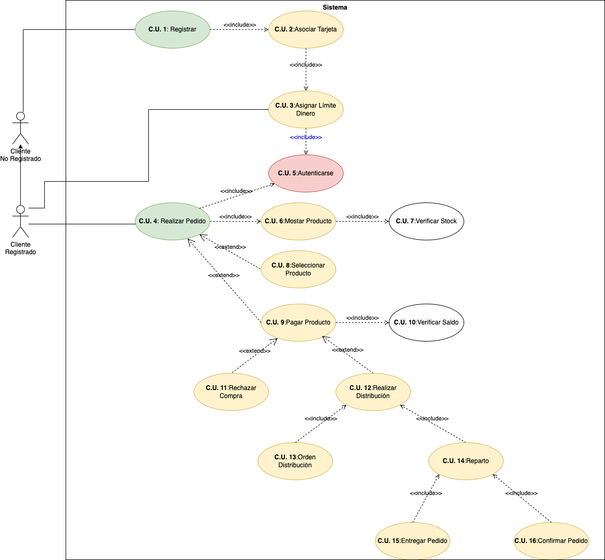

# Tienda Virtual. 

  

El sistema tendrá que gestionar las cuentas de los clientes que realizan pedidos de productos del negocio. Cada producto tiene un stock determinado. Generalmente un cliente tiene una o varias cuentas para pagar los pedidos y cada cuenta tiene asociada una tarjeta de crédito con una cantidad disponible de dinero. Esa cantidad puede aumentarse por parte del cliente para poder realizar más pedidos.

Los clientes que quieran realizar un pedido tendrán que tener alguna cuenta con saldo disponible.

Los pedidos pueden ser simples o compuestos. Un pedido simple solamente tendrá una cuenta de pago y como mucho tendrá 20 productos. 

Un pedido compuesto puede tener dos o más pedidos (simples o compuestos). Obviamente un pedido compuesto se tiene que pagar con la cuenta de un mismo cliente.

Solamente se pueden pedir productos que estén en stock.

Los cobros se hacen diariamente a las 23:59 horas. En ese procedimiento de cobro se comprueban todos los pedidos pendientes de cobro y se cobran de las cuentas de los clientes. Si una cuenta de cliente __NO__ tiene dinero suficiente se __RECHAZA__ el pedido (tanto si es simple como si forma parte de un pedido compuesto).

Una vez superado este proceso se genera la orden de distribución y confirma los pedidos.

Los pedidos listos de reparto se entregan y una vez entregados su estado pasa a estar confirmado.

> __Información__. Un cliente puede o no registrado previamente, con lo cual la realización de pedidos __supuno realizar un registro, para más tarde autenticarse__.

Realiza:
- Identifica los actores.
- Identifica los __CU__ de cada uno de los actores.
- Realiza el diagrama de CU.
- La especificación de CU.

<!--  

      
PULSA PARA VER LA SOLUCIÓN 

   
  
   
-->

Vamos a ir desglosando la información que obtenemos de cada uno de los párrafos. En el primer párrafo tenemos la siguiente información:

> __Información__: El sistema tendrá que gestionar las cuentas de los clientes que realizan pedidos de productos del negocio. Cada producto tiene un stock determinado. Generalmente un cliente tiene una o varias cuentas para pagar los pedidos y cada cuenta tiene asociada una tarjeta de crédito con una cantidad disponible de dinero. Esa cantidad puede aumentarse por parte del cliente para poder realizar más pedidos.

En primer lugar vemos que se hace referencia a los clientes, y que estos realizan acciones, es por ello, que clientes será nuestro primer actor. Además vamos a tener en cuenta que existen dos tipos de clientes, los registrados en el sistema, y aquellos que no se han registrado aún en él. Por esto, tendremos nuestro segundo actor en el sistema.
El cliente debe de __registrarse__ _(caso de uso)_ y más tarde, una vez registrado, puede __asociar tarjetas__ _(caso de uso)_ y __establecer un límite de dinero en ellas__ _(caso de uso)_. _Otra opción o camino a seguir es que el límete de las tarjetas las maneje el banco a las que este asociada la tarjeta en cuestión._ Si siguiéramos este camino, debemos añadir un nuevo __actor__, _(banco)_ en nuestro sistema.

> Los clientes que quieran realizar un pedido tendrán que tener alguna cuenta con saldo disponible.

Nos indica que existe un nuevo _(caso de uso)_, que podremos llamar __realizar pedido__, y que estará asociado a otro __comprobar saldo__, es decir, realizar pedido _incluye_ comprobar saldo.

> Los pedidos pueden ser simples o compuestos. Un pedido simple solamente tendrá una cuenta de pago y como mucho tendrá 20 productos. 

El pedido compuesto parece ser un extensible del pedido simple o podemos ver que un pedido compuesto incluye al menos un pedido simple.

> Solamente se pueden pedir productos que estén en stock.

Aquí podemos ver que podríamos mostrar los pedidos en stock o no, pero sólo comprar aquellos que están en stock. Para simplificar, sólo se muestran los productos en stock. Tendremos entonces un nuevo _(caso de uso)_, que podremos llamar __mostrar/listar productos__ que tendrá asociado uno nuevo _(caso de uso)_, que llamaremos __verificar stock__.

Los pasos que tenemos hasta el momento para la gestión de pedidos serán:
- Comprobar saldo.
- Mostrar productos. Recuerda que sólo tratamos aquellos con __stock__.
- Seleccionar productos. Aquellos que vamos a comprar.
- Finalizar/Pagar productos.

> Revisa como se relacionan los distintos __casos de uso__ (includes / excludes).

En este momento hemos dejado atrás la validación, ___"autenticación"___ de los clientes en el proceso. Se debe de analizar en que punto se debe de realizar. Es decir, los casos de uso requieren autenticación ___include___, o he de autenticarme para luego realizar otra acción, un ___extend___ en este caso.

> __Información:__ En ese procedimiento de cobro se comprueban todos los pedidos pendientes de cobro y se cobran de las cuentas de los clientes. Si una cuenta de cliente NO tiene dinero suficiente se RECHAZA el pedido (tanto si es simple como si forma parte de un pedido compuesto).

De aquí obtenemos el _(caso de uso_) finalizar/Pagar producto. En este momento hemos de tener en cuenta lo anteriormente mencionado:
> ¿Quién es el responsable de la gestión del cobro como tal: el propio sistema/actor externo _(banco)_?

Finalizar/Hacer Pago, se relaciona _(extend)_ con otros dos casos de uso:
- Rechaza. No existe saldo suficiente.
- Generar orden de distribución, que será pasar a proceso de pago.  

> __Información:__ Una vez superado este proceso se genera la orden de distribución y confirma los pedidos.

El proceso a continuación del proceso de _de orden de distribución_ es la __confirmación de los pedidos__. Es decir estos dos _casos de uso_ se relacionan, con el _caso de uso_ del que dependen que podríamos llamar __distribución_. Es por ellos que cada uno tendrá una relación de __include__, es decir, si se acepta el pedido (_Distrución_) con lleva: Generar la orden de distribución y confirmar el pedido.

> __Información:__ Los pedidos listos de reparto se entregan y una vez entregados su estado pasa a estar confirmado.

Un pedido confirmado con lleva dos casos de uso:
- La entrega del pedido.
- La confirmación de este. Recordar que esto es una acción que se realiza, y repercute en la modificación de un valor de la entidad __pedido__.

Las relaciones de estos dos pedidos en confirmar pedido es __include__, es decir se debe de realizar ambas acciones.

La representación de lo anteriormente explicado será el siguiente diagrama.

  

## Especificación de Actores y Casos de Uso:

### Especificación de Actores

  En el presente documento se realiza la especificación de los diferentes actores que intervienen en la solución propuesta.

#### Cliente No Registrado

  | Actor | Cliente No Registrado |
  |---|---|
  | Descripción  | Generalmente un cliente tiene una o varias cuentas para pagar los pedidos y cada cuenta tiene asociada una tarjeta de crédito con una cantidad disponible de dinero |
  | Características  | Su principal característica es que sólo puede realizar el registro y el asociamiento de tarjetas y límete de dinero |
  | Relaciones |   |
  | Referencias | La información relacionada con el actor se encuentra en [este documento](https://github.com/jpexposito/ets/tree/main/diagramas-comportamiento/diagramas-cu/tareas/tarea6). |   
  |  Notas | Los mismos casos de uso que realiza este actor, pueden ser realizados por el __cliente registrado__ pudiendo mostrarse esa relación de diferentes formas.  |
  | Autor  | _Joatham Pérez Expósito_ |
  |Fecha | _27/01/2023_ |

#### Cliente Registrado

| Actor | Cliente Registrado |
  |---|---|
  | Descripción  | El cliente registrado podrá realizar el proceso de pedido de productos, debiendo estar autenticado para realizar este proceso.  |
  | Características  | Existen distintos procesos _(casos de uso)_ que se producen de forma automática en función de las decisiones del cliente o si este dispone de saldo o no, entre otras cosas. |
  | Relaciones | Este actor se encuentra relacionado con el actor _cliente no registrado_, dado que, tal y como dice el texto: _Generalmente un cliente tiene una o varias cuentas para pagar los pedidos_. |
  | Referencias | La información relacionada con el actor se encuentra en [este documento](https://github.com/jpexposito/ets/tree/main/diagramas-comportamiento/diagramas-cu/tareas/tarea6).  |   
  |  Notas |   |
  | Autor  | _Joatham Pérez Expósito_ |
  |Fecha | _27/01/2023_ |

### Especificación de Casos de uso

#### Registro

| Caso de Uso CU.1 | Registro |
|---|---|
| Fuentes  | El caso de uso se sustenta en [este documento](https://github.com/jpexposito/ets/tree/main/diagramas-comportamiento/diagramas-cu/tareas/tarea6).  |
| Actor  | Cliente No Registrado |
| Descripción | Un cliente puede o no registrado previamente, con lo cual la realización de pedidos supuno realizar un registro, para más tarde autenticarse. |
| Flujo básico |  |
| Pre-condiciones |  |  
| Post-condiciones  | Asociacimiento de una cuenta al usuario _(caso uso 2)_|  
|  Requerimientos | |
|  Notas |  |
| Autor  | _Joatham Pérez Expósito_ |
|Fecha | _27/01/23_ |

#### Asociar tarjeta a cuenta

| Caso de Uso CU.2 | Asociar Tarjeta |
|---|---|
| Fuentes  | El caso de uso se sustenta en [este documento](https://github.com/jpexposito/ets/tree/main/diagramas-comportamiento/diagramas-cu/tareas/tarea6).  |
| Actor  | Cliente No Registrado |
| Descripción | Cada cuenta tiene asociada una tarjeta de crédito. |
| Flujo básico |  |
| Pre-condiciones |  |  
| Post-condiciones  | Asociacimiento de una cuenta al usuario _(caso uso 2)_|  
|  Requerimientos | |
|  Notas |  |
| Autor  | _Joatham Pérez Expósito_ |
|Fecha | _27/01/23_ |

#### Asociar tarjeta a cuenta

| Caso de Uso CU.3 | Establecer Límite Dinero |
|---|---|
| Fuentes  | El caso de uso se sustenta en [este documento](https://github.com/jpexposito/ets/tree/main/diagramas-comportamiento/diagramas-cu/tareas/tarea6).  |
| Actor  | Cliente No Registrado, Cliente Registrado |
| Descripción | Una tarjeta de crédito tendrá una cantidad disponible de dinero. Esa cantidad puede aumentarse por parte del cliente para poder realizar más pedidos. |
| Flujo básico | Asociar Tarjeta -> Establecer Límite Dinero |
| Pre-condiciones |  |  
| Post-condiciones  | |  
| Requerimientos | Disponer de una tarjeta de credito. > Nota: Se trata de un requerimiento y no una precondición dado que este caso de uso lo pueden hacer dos actores en momentos distintos |
| Notas |  |
| Autor  | _Joatham Pérez Expósito_ |
|Fecha | _27/01/23_ |

#### Realizar Pedido

| Caso de Uso CU.4 | Realizar Pedido |
|---|---|
| Fuentes  | El caso de uso se sustenta en [este documento](https://github.com/jpexposito/ets/tree/main/diagramas-comportamiento/diagramas-cu/tareas/tarea6).  |
| Actor  | Cliente Registrado |
| Descripción | Un usuario registrado podrá realizar pedidos de productos |
| Flujo básico | El usuario se autenticará, seleccionará los distintos productos que desea comprar y realiza la compra. |
| Pre-condiciones |  |  
| Post-condiciones  |  |  
| Requerimientos | Disponer de una cuenta _(caso uso 1)_. |
| Notas |  |
| Autor  | _Joatham Pérez Expósito_ |
|Fecha | _27/01/23_ |

#### Autenticación

| Caso de Uso CU.5 | Autenticación |
|---|---|
| Fuentes  | El caso de uso se sustenta en [este documento](https://github.com/jpexposito/ets/tree/main/diagramas-comportamiento/diagramas-cu/tareas/tarea6).  |
| Actor  | |
| Descripción | El cliente debe estar registrado para el proceso de compra de productos o para el aumento del límite de sus tarjeta asociado a las tarjetas. |
| Flujo básico | |
| Pre-condiciones |  |  
| Post-condiciones  | |  
| Requerimientos | Disponer de una cuenta _(caso uso 1)_. |
| Notas | Esta acción la realiza el propio __Sistema__ de forma automatizada. |
| Autor  | _Joatham Pérez Expósito_ |
|Fecha | _27/01/23_ |

#### Mostrar Producto

| Caso de Uso CU.6 | Mostrar Producto |
|---|---|
| Fuentes  | El caso de uso se sustenta en [este documento](https://github.com/jpexposito/ets/tree/main/diagramas-comportamiento/diagramas-cu/tareas/tarea6).  |
| Actor  | Cliente Registrado |
| Descripción | Solamente se pueden pedir productos que estén en stock. |
| Flujo básico | |
| Pre-condiciones | Sólo se mostrarán aquellos productos de los que se dispone de stock. |  
| Post-condiciones  | |  
| Requerimientos |  |
| Notas | Esta acción la realiza el propio __Sistema__ de forma automatizada. |
| Autor  | _Joatham Pérez Expósito_ |
|Fecha | _27/01/23_ |

#### Verificar Stock

| Caso de Uso CU.7 | Verificar Stock |
|---|---|
| Fuentes  | El caso de uso se sustenta en [este documento](https://github.com/jpexposito/ets/tree/main/diagramas-comportamiento/diagramas-cu/tareas/tarea6).  |
| Actor  | |
| Descripción | Cada producto tiene un stock determinado. Solamente se pueden pedir productos que estén en stock.|
| Flujo básico | |
| Pre-condiciones |  |  
| Post-condiciones  | |  
| Requerimientos |  |
| Notas | Esta acción la realiza el propio __Sistema__ de forma automatizada. |
| Autor  | _Joatham Pérez Expósito_ |
|Fecha | _27/01/23_ |

#### Seleccionar Producto

| Caso de Uso CU.8 | Seleccionar Producto |
|---|---|
| Fuentes  | El caso de uso se sustenta en [este documento](https://github.com/jpexposito/ets/tree/main/diagramas-comportamiento/diagramas-cu/tareas/tarea6).  |
| Actor  | |
| Descripción | Sólo serán seleccionables aquellos productos que se encuentran en stock |
| Flujo básico | |
| Pre-condiciones | Los productos mostrados serán aquellos que se encuentran disponibles, es decir, con __stock__. |  
| Post-condiciones  | |  
| Requerimientos |  |
| Notas | Esta acción la realiza el propio __Sistema__ de forma automatizada. |
| Autor  | _Joatham Pérez Expósito_ |
|Fecha | _27/01/23_ |

#### Pagar Producto

| Caso de Uso CU.9 | Pagar Producto |
|---|---|
| Fuentes  | El caso de uso se sustenta en [este documento](https://github.com/jpexposito/ets/tree/main/diagramas-comportamiento/diagramas-cu/tareas/tarea6).  |
| Actor  | |
| Descripción | Generalmente un cliente tiene una o varias cuentas para pagar los pedidos y cada cuenta tiene asociada una tarjeta de crédito con una cantidad disponible de dinero. |
| Flujo básico | |
| Pre-condiciones | _Caso de uso: Verificar Saldo_ |  
| Post-condiciones  | Rechazar compra o Realizar Distribución |  
|  Requerimientos | Disponer una tarjeta y saldo asociada a ella |
| Notas | Esta acción la realiza el propio __Sistema__ de forma automatizada. |
|  Autor  | _Joatham Pérez Expósito_ |
|Fecha | _27/01/23_ |

#### Verifiar Saldo

| Caso de Uso CU.10 | Verificar Saldo |
|---|---|
| Fuentes  | El caso de uso se sustenta en [este documento](https://github.com/jpexposito/ets/tree/main/diagramas-comportamiento/diagramas-cu/tareas/tarea6).  |
| Actor  | |
| Descripción | Los clientes que quieran realizar un pedido tendrán que tener alguna cuenta con saldo disponible. |
| Flujo básico | |
| Pre-condiciones |  |  
| Post-condiciones  | |  
| Requerimientos | Disponer de saldo asociado a la cuenta |
| Notas | Esta acción la realiza el propio __Sistema__ de forma automatizada. |
| Autor  | _Joatham Pérez Expósito_ |
|Fecha | _27/01/23_ |

#### Rechazar Compra

| Caso de Uso CU.11 | Rechazar Compra |
|---|---|
| Fuentes  | El caso de uso se sustenta en [este documento](https://github.com/jpexposito/ets/tree/main/diagramas-comportamiento/diagramas-cu/tareas/tarea6).  |
| Actor  | |
| Descripción | Si una cuenta de cliente __NO__ tiene dinero suficiente se __RECHAZA__ el pedido. |
| Flujo básico | |
| Pre-condiciones |  |  
| Post-condiciones  | |  
| Requerimientos |  |
| Notas | Esta acción la realiza el propio __Sistema__ de forma automatizada. |
| Autor  | _Joatham Pérez Expósito_ |
|Fecha | _27/01/23_ |

#### Realizar Distribución

| Caso de Uso CU.12 | Realizar Distribución |
|---|---|
| Fuentes  | El caso de uso se sustenta en [este documento](https://github.com/jpexposito/ets/tree/main/diagramas-comportamiento/diagramas-cu/tareas/tarea6).  |
| Actor  | |
| Descripción | Una vez superado este proceso de pago se genera la orden de distribución y confirma los pedidos. |
| Flujo básico | |
| Pre-condiciones | Realización del pago de los productos |  
| Post-condiciones  | |  
| Requerimientos |  |
| Notas | Esta acción la realiza el propio __Sistema__ de forma automatizada. |
| Autor  | _Joatham Pérez Expósito_ |
|Fecha | _27/01/23_ |

#### Orden de Distribución

| Caso de Uso CU.13 | Orden de Distribución |
|---|---|
| Fuentes  | El caso de uso se sustenta en [este documento](https://github.com/jpexposito/ets/tree/main/diagramas-comportamiento/diagramas-cu/tareas/tarea6).  |
| Actor  | |
| Descripción | Una vez que se ha realizado el pago de los productos se produce una orden de distribución de estos |
| Flujo básico | |
| Pre-condiciones | El pago de los productos |  
| Post-condiciones  | |  
| Requerimientos |  |
| Notas | Esta acción la realiza el propio __Sistema__ de forma automatizada. |
| Autor  | _Joatham Pérez Expósito_ |
|Fecha | _27/01/23_ |

#### Reparto

| Caso de Uso CU.14 | Reparto |
|---|---|
| Fuentes  | El caso de uso se sustenta en [este documento](https://github.com/jpexposito/ets/tree/main/diagramas-comportamiento/diagramas-cu/tareas/tarea6).  |
| Actor  | |
| Descripción | Una vez se ha generado la orden de distribución, se procederá al reparto de los productos |
| Flujo básico | |
| Pre-condiciones | Orden de Distribución. |  
| Post-condiciones  | |  
| Requerimientos |  |
| Notas | Esta acción la realiza el propio __Sistema__ de forma automatizada. |
| Autor  | _Joatham Pérez Expósito_ |
|Fecha | _27/01/23_ |

#### Entregar Pedido

| Caso de Uso CU.15 | Entrregar Pedido |
|---|---|
| Fuentes  | El caso de uso se sustenta en [este documento](https://github.com/jpexposito/ets/tree/main/diagramas-comportamiento/diagramas-cu/tareas/tarea6).  |
| Actor  | |
| Descripción | Los pedidos listos de reparto se entregan y una vez entregados su estado pasa a estar confirmado. |
| Flujo básico | |
| Pre-condiciones |  |  
| Post-condiciones  | |  
| Requerimientos |  |
| Notas | Esta acción la realiza el propio __Sistema__ de forma automatizada. |
| Autor  | _Joatham Pérez Expósito_ |
|Fecha | _27/01/23_ |

#### Confirmación de Pedido

| Caso de Uso CU.15 | Confirmación de Pedido |
|---|---|
| Fuentes  | El caso de uso se sustenta en [este documento](https://github.com/jpexposito/ets/tree/main/diagramas-comportamiento/diagramas-cu/tareas/tarea6).  |
| Actor  | |
| Descripción | Los pedidos listos de reparto se entregan y una vez entregados su estado pasa a estar confirmado. |
| Flujo básico | |
| Pre-condiciones | Entrega del pedido |  
| Post-condiciones  | |  
| Requerimientos |  |
| Notas | Esta acción la realiza el propio __Sistema__ de forma automatizada. |
| Autor  | _Joatham Pérez Expósito_ |
|Fecha | _27/01/23_ |

